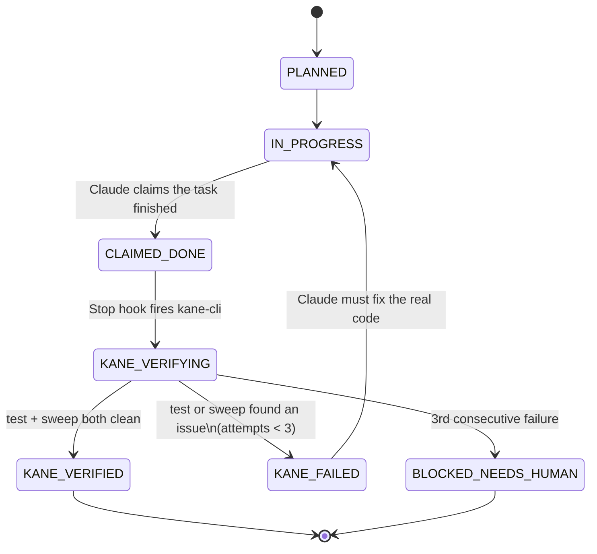
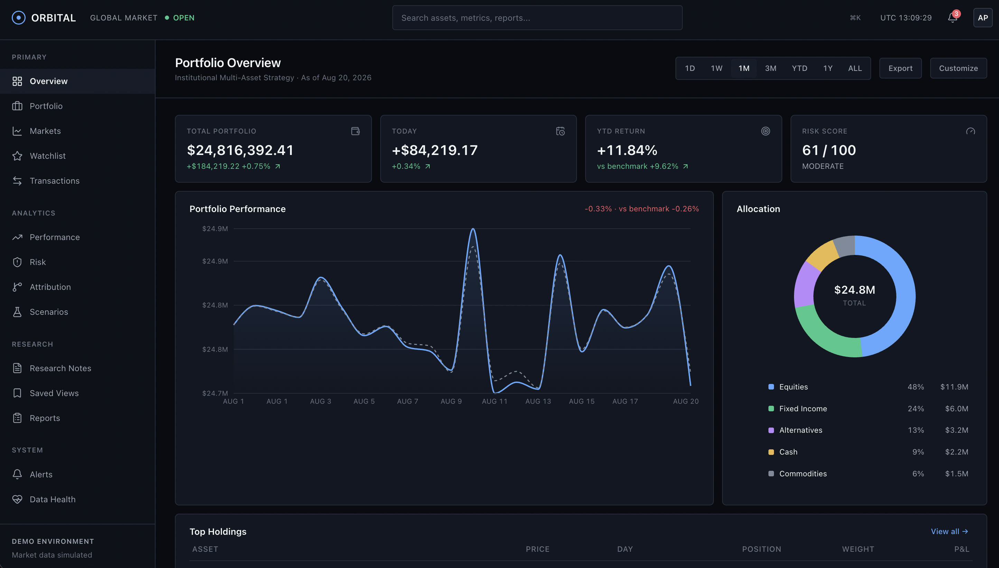
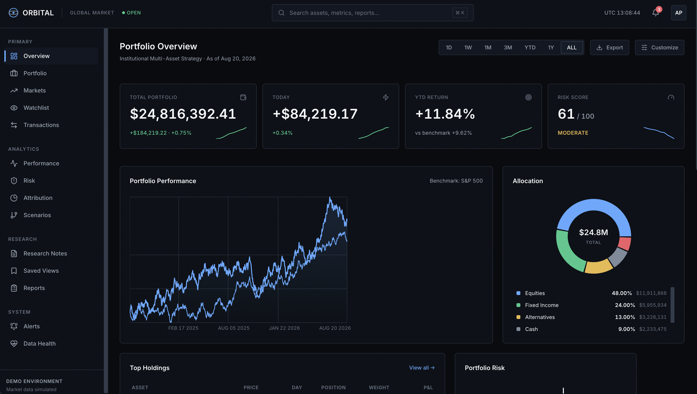
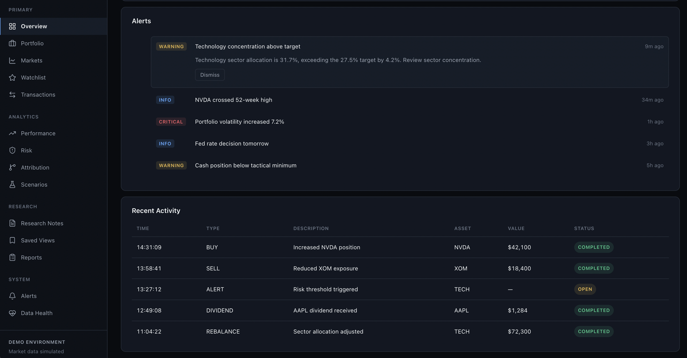
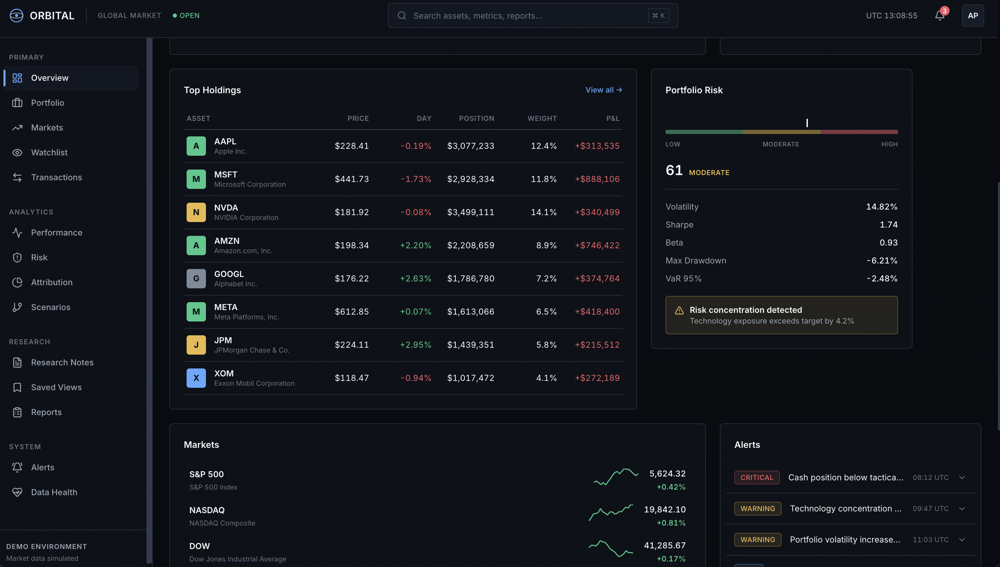

# Observations & Reportings

A build log and evidence report for GuardianKane — what the product actually does, how it was designed, and what four independent A/B experiments show about the gap between an agent that self-reports "done" and one that has to prove it in a browser.

---

## 1. What GuardianKane actually does

GuardianKane is a Claude Code **Stop-hook + PostToolUse-hook + task-tracker state machine** that makes "done" an externally-verified state instead of a self-reported one. Concretely, it:

- Intercepts every `Stop` event Claude Code emits and inspects a structured `task-tracker.md` for a task marked `CLAIMED_DONE`.
- Refuses to let that stop happen until it has independently driven `kane-cli` to open a real browser, replay a generated test against the running dev server, and run a second ad-hoc **defect sweep** against the task's PRD section.
- Tracks a hard 3-attempt cap per task before escalating to `BLOCKED_NEEDS_HUMAN` — it never lets an agent loop forever guessing at a fix, and never lets it walk away pretending success either.
- Records every confirmed defect in a local **bug memory** (`lib/bug-memory.js`) so a regression of a previously-fixed bug — on any later task — gets flagged with a similarity note instead of being re-diagnosed from zero.
- Logs every state transition to an activity trail so the entire verification history of a build is reconstructable after the fact.
- Ships as a one-command installer (`install.sh`) that wires all of the above into any git-initialized Claude Code project without touching existing hooks or breaking an existing CommonJS `package.json`.

None of this requires the coding agent to change how it writes code. It changes what "I'm done" is allowed to mean.

---

## 2. The build process, start to finish

### 2.1 PRD review and grilling

Every experiment in this repo starts from a written PRD (`todo-kane/PRD.md`, `booking-kane/PRD.md`, `booking-studio-kane/PRD.md`, `orbital-kane/PRD.md`). Before any code is written, GuardianKane's `start` flow runs a **grilling pass** — a structured conversation whose entire purpose is to find every place the PRD is ambiguous and force a concrete decision *before* it can become an accidental one baked in by whichever interpretation was easiest to code.

The clearest example is the todo-app experiment. Its PRD specifies that new tasks default to a "Medium" priority badge — and says nothing else about priority. The grilling pass surfaced the obvious follow-up question ("okay, but how does a user or the app ever set a task to High or Low?") and resolved it into a concrete, testable convention: a `!high` / `!low` suffix on the task title. That decision became `task-tracker.md#T5`, and `kane-cli generate` authored a real test around it.

Run the same PRD text through a fresh, context-free agent in one shot with no grilling step, and the ambiguity resolves itself silently in the direction of least effort: `todo-baseline` implements the documented default and *nothing else* — no mechanism to set High or Low priority exists anywhere in the app. That's not a bug you'd find by reading the code or clicking around; every task quietly shows "Medium" and looks correct. It only surfaces under the exact adversarial check the grilling conversation produced.

### 2.2 Planning — the task tracker

Grilling output becomes `task-tracker.md`: a YAML-fronted list of tasks, each with an `id`, `title`, `prd_ref` (the exact PRD line range it implements), `verification_mode` (`kane` or `manual`), `test_file` (which generated test(s) gate it), `depends_on`, and a `state` field that the Stop hook — and only the Stop hook — is allowed to advance through `KANE_*` values. Nothing else in the system is permitted to write a `KANE_VERIFIED` state directly; that's the entire point of the gate.

For ORBITAL, this produced 12+ tasks spanning the full PRD: dashboard shell navigation, the performance chart with its lock state, the allocation donut, the holdings table with security popovers, the risk monitor, market rows, alerts, activity feed, export flow, layout customization, profile popover, and global search — each with its own `prd_ref` and its own generated test(s).

### 2.3 Phases

Each build proceeded through the same phase structure regardless of experiment size:

1. **Scaffold** (T0) — clone/boot the app skeleton, verified as its own gated task with no PRD section of its own.
2. **Per-feature implementation loop** — for each `task-tracker.md` row: implement → mark `CLAIMED_DONE` → Stop hook fires → `KANE_VERIFYING` → pass/fail → `KANE_VERIFIED` or back to `IN_PROGRESS`.
3. **Sync/finalize** — once every row is `KANE_VERIFIED`, the build is complete and ready for `/guardian-kane open-pr`.

### 2.4 Implementation and test generation

Test generation is never hand-authored. `kane-cli generate` / `kane-cli design tests` produces runnable `*_test.md` files scoped to each task's `prd_ref`, stored under `.testmuai/tests/`. These are the exact files the Stop hook later replays — the same artifact that authored the coverage is the one that gates the code, so there's no drift between "what we said we'd test" and "what actually runs."

### 2.5 Browser verification

`kane-cli` drives a real, local Chrome instance via CDP against the task's running dev server. Two independent checks run per task:

- **Scripted replay** — the generated `_test.md` steps, executed exactly as authored, exit code 0/1/2/3 mapped straight into the Stop-hook decision table.
- **Defect sweep** — a second, unscripted pass that looks at the live app against the same PRD section and asks whether anything *else* is visibly wrong. This is deliberately looser than the scripted test — it's what catches things no one thought to assert explicitly.

Every raw `failed` result in this repo's evidence — not just the passing ones — was individually re-inspected against Kane's own `verdict.confirmed` / `family` / `category` fields rather than trusted at face value, because `kane-cli`'s own browser-automation agent is itself fallible (slow to act inside a toast's display window, occasionally misreads a replay). Treating a raw exit code as ground truth without that inspection would have manufactured false positives against the apps being tested. That discipline is applied consistently across all four experiments — see `docs/SCOREBOARD.md` for the full itemized record.

### 2.6 The fix-loop state machine, in practice

On ORBITAL specifically, several tasks show this loop actually firing in the tracker's recorded history rather than sailing through on the first try:

- **T2 (portfolio performance chart)** — an `overridden_state: BLOCKED_NEEDS_HUMAN` entry with `bug_title: "Replay misclassifies unlocked chart state"` — the sweep caught a real state-tracking defect in the chart's lock affordance.
- **T3 (allocation donut)** and **T4 (holdings table)** — both also show `overridden_state: BLOCKED_NEEDS_HUMAN` entries from the sweep catching issues beyond what the scripted test alone checked.
- **T9 (export flow)** — `overridden_state: KANE_FAILED`, `confidence: 0.88`, `bug_title: "Agent waited for export toast without queuing export"` — a genuine race between the UI action and the notification it should have triggered.
- **T10 (layout customization)** and **T11 (profile popover)** — further `KANE_FAILED` entries, several later re-classified `confirmed: false` / `automation_bug` on inspection (the sweep's own agent stalling, not the app) — exactly the discipline described in §2.5.

Every one of these is a case where the app was not allowed to reach `KANE_VERIFIED` on the strength of Claude's own claim that it was finished. Some were real product defects; some were Kane's own automation being imperfect. GuardianKane's job in both cases is the same: force the question to be checked externally rather than assumed.

### 2.7 The project's error-surface memory (bug memory)

`lib/bug-memory.js` is a dependency-free local JSON store keyed by Jaccard token-set similarity over `bugTitle` + `rootCause` text. Every confirmed defect from a scripted-test failure or a sweep hit gets recorded with its originating task id. On every subsequent failure, GuardianKane checks the new defect's title/root-cause against everything recorded so far (excluding the same task) — a similarity ≥ 0.5 surfaces a note appended directly to the Stop hook's denial reason:

> *GuardianKane memory: this resembles a bug previously seen on T-4 ("Chart lock sign inverted", similarity 0.71) — check whether that earlier fix regressed or this is the same defect resurfacing elsewhere.*

This never changes the gating decision — it's purely additive context — but it means a bug fixed once and quietly reintroduced later doesn't get re-diagnosed from a blank slate. No LLM call, no vector database, no external service: five functions (`loadMemory`, `saveMemory`, `recordBug`, `findMatches`) and a JSON file, fully covered by `lib/bug-memory.test.js`.

---

## 3. Evidence: the four experiments

### 3.1 Todo app — both builds worked

Low-ambiguity PRD, mostly CRUD. `todo-kane` reached `KANE_VERIFIED` on every task. `todo-baseline` also passed every functional test that could be replayed against it — **except** the priority-badge gap described in §2.1, a confirmed `major`-severity functional gap Kane's own verdict called out explicitly (`"The high-priority task is displayed with a MEDIUM badge instead of High."`). This is the cleanest, smallest illustration of the thesis: the grilling step turns an invisible silent-default choice into a forcing function.

### 3.2 Room Booking Widget — no confirmed divergence, but real value anyway

A harder, from-scratch PRD with a deliberate boundary-condition trap (touching-interval bookings must be allowed; overlapping ones must not). Both `booking-kane` and `booking-baseline` got the trap right — no functional gap surfaced. The honest finding here isn't a caught bug, it's that GuardianKane's value on this run was in *proving* the correct behavior rather than *assuming* it: `booking-baseline`'s self-reported claim of correct interval logic had to be, and was, independently verified rather than trusted — which is exactly the discipline GuardianKane enforces on every task, every time, without exception.

### 3.3 Room Booking Studio — the granular-detail PRD

A PRD with 14+ exact, independently-checkable design specifics (hex colors, an 8px spacing scale, corner radii, toast slide-in/progress-bar/auto-dismiss timing, a 5s Undo window, Escape-key priority rules, a persisted theme key). `booking-studio-kane` reached 8 of 10 independently-verified requirement groups (the remaining 2 were traced to Kane's own automation timing, not the app, on inspection). Manual side-by-side comparison found one concrete, PRD-literal divergence on `booking-studio-baseline`: its header row renders with the title and theme-toggle flush against the viewport edge, violating the PRD's explicit 16px-padding requirement — exactly the class of granular detail this experiment was built to expose, and it surfaced on the unassisted build, not the gated one.

### 3.4 ORBITAL — the flagship result

ORBITAL is a dense, single-page institutional portfolio dashboard: 12+ interactive subsystems (performance chart with a lock affordance, allocation donut, holdings table with security popovers, risk monitor, market rows, alerts, activity feed, export flow with a fake-success toast, layout customization, profile popover, global search). It's the largest, most visually demanding PRD in the set, and it's where the gap between the gated and unassisted builds is not subtle.

**Portfolio Performance chart — a genuinely broken chart, caught in one build, shipped in the other**

`orbital-kane`'s chart renders a single, clean solid trend line plus a visually distinct dashed benchmark-comparison line:

`orbital-baseline`'s chart renders **two overlapping, differently-weighted line traces on the same series simultaneously** — a visibly doubled, glitchy chart that never should have shipped as "done":

This is not a subjective styling call. It's the kind of defect that is completely invisible from reading component code — the data flows correctly, the chart *library call* looks fine — and only becomes obvious the moment a human, or a browser-driving verifier, actually looks at the rendered page. GuardianKane's defect sweep exists precisely to force that look; `orbital-kane`'s own tracker shows the sweep catching a related chart-state defect at T2 (`bug_title: "Replay misclassifies unlocked chart state"`) before the task was ever allowed to reach `KANE_VERIFIED`.

**Alerts panel — a real PRD layout deviation**

The PRD calls for a single-column, full-width, vertically-stacked alert list with single-expand behavior. `orbital-kane` matches that exactly:

`orbital-baseline` drifted from the spec into a compact, side-by-side two-column layout instead — a structural deviation from the PRD's documented single-column intent, not a cosmetic variation:

**Inconsistent card spacing**

The same baseline screenshot above also shows uneven gaps between panel groups — the space around the alerts block does not match the space around the holdings/risk cards beneath it in the same view. `orbital-kane`'s dashboard (visible in `docs/images/orbital-kane-2.png`) keeps a uniform spacing scale across every panel boundary, consistent with the PRD's layout requirements. Inconsistent spacing like this is exactly the kind of granular-but-real deviation the Booking Studio experiment (§3.3) predicted would show up whenever a PRD carries real visual density and no external check forces a second look.

**Other defects the gate caught before they could ship (from `orbital-kane`'s own tracker)**

- T2: chart lock-state misclassification (`BLOCKED_NEEDS_HUMAN` override, sweep-caught)
- T3, T4: additional sweep-caught issues on the allocation donut and holdings table, both routed to human review rather than silently accepted
- T9: the export flow raced ahead of its own success toast (`confidence: 0.88`) — the kind of timing bug that passes a casual click-through and fails the moment someone checks the toast actually appears
- T10, T11: further sweep findings, some later correctly re-classified as Kane automation artifacts rather than app defects (§2.5's inspection discipline applied in practice, not just in theory)

**What ORBITAL actually demonstrates:** on a PRD with real visual and interactional density, an unsupervised single-pass build reliably drops exactly the kind of thing casual inspection misses — a doubled chart, a structural layout deviation from the spec, inconsistent spacing — while the gated build's sweep step caught multiple defects of the same character *before* they were allowed to count as done. This is the clearest, most visually undeniable version of the pattern that ran through all four experiments: Claude is already strong at getting the obvious cases right; GuardianKane's value shows up precisely where "looks right at a glance" and "is actually right" diverge.

---

## 4. Summary

| Experiment | What grilling/planning resolved | What the gate caught |
|---|---|---|
| Todo app | An unspecified priority-setting mechanism | Baseline never implemented it at all — confirmed major functional gap |
| Booking Widget | A boundary-condition trap in the PRD | Nothing — both correct, but only one was *proven* correct |
| Booking Studio | 14+ exact design/interaction specifics | Baseline's header padding violated the PRD literally |
| **ORBITAL** | 12+ subsystem PRD sections with dense visual specs | **Doubled chart lines, a structural alert-layout deviation, inconsistent card spacing, a chart lock-state bug, and an export/toast race — all in baseline, all invisible without a browser-level check** |

Four experiments, one consistent shape: the smaller and more forgiving the PRD, the smaller the observable gap. The denser and more visually real the PRD gets, the more that gap turns into exactly the kind of shipped defect a user would actually notice — and the more clearly GuardianKane's gate earns its keep.
